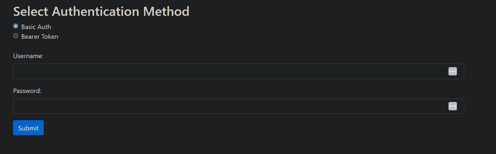
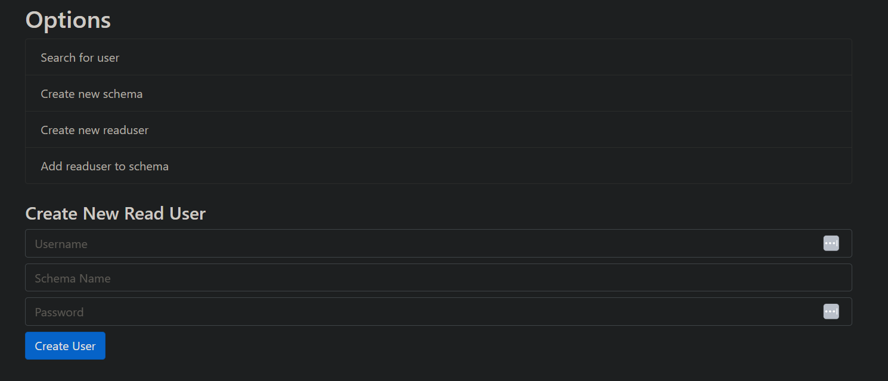

# JIRA Datacenter SQL Database Interface

## Warning
This application authenticates the user against an internal Scriptrunner API and will only work if they are part of the admin group. 

## Prerequisites
Set up Venv

1. Download and install Docker:
   [Docker Desktop](https://www.docker.com/products/docker-desktop/)
2. Restart your computer after the installation is complete.
3. Download or clone this repository to your local machine.
4. Log in to Docker Desktop or create a new account if you don't have one.
5. Run `Create Image.bat` to build the Docker image for this application.
6. Wait for the image to be built. You will see a confirmation message once the build is complete.
7. Run `1. RUN.bat`. After a short delay, it will automatically open the `http://localhost:5000` page in your default web browser.

## Application Screenshots

### Login Screen


### Options Screen


## How to Use the Database Toolkit
To effectively use the toolkit, follow these steps:

1. Authenticate using your credentials or a bearer token as required by the application.
2. Utilize the on-screen options to:
   - Search for existing users.
   - Create new users or schemas.
   - Add users to schemas.
3. Always check if the user requesting access already has an account before creating a new one.
4. Be mindful to follow the on-screen instructions regarding naming conventions for schemas and read users, such as `readschema_xyz` and `readuser_xyz_username`.

## Flask API for Screen Management

This repository contains a Flask API for managing screens, including login, renaming screens, and copying screens.

### Requirements

- Python 3.x
- Flask
- requests

### Installation

1. Clone the repository:
    ```sh
    git clone https://github.com/yourusername/jira-dc-database-interface.git
    cd jira-dc-database-interface
    ```

2. Create a virtual environment and activate it:
    ```sh
    python -m venv venv
    source venv/bin/activate  # On Windows use `venv\Scripts\activate`
    ```

3. Install the required packages:
    ```sh
    pip install -r requirements.txt
    ```

### API Endpoints

#### 1. Login

- **URL:** `/login`
- **Method:** `POST`
- **Form Data:**
    - `auth_type`: `basic` or `bearer`
    - If `basic`: `username` and `password`
    - If `bearer`: `token`
- **Response:**
    - On success: Renders the `screens.html` template with screens data.
    - On failure: Returns `401` status code.

#### 2. Rename Screen

- **URL:** `/edit_screen_name`
- **Method:** `POST`
- **JSON Payload:**
    - `name`: New name for the screen
    - `screenId`: ID of the screen to rename
- **Response:**
    - On success: Returns a JSON response with updated screens data.
    - On failure: Returns appropriate status code and message.

#### 3. Copy Screen

- **URL:** `/copy_screen`
- **Method:** `POST`
- **JSON Payload:**
    - `name`: New name for the copied screen
    - `screenId`: ID of the screen to copy
- **Response:**
    - On success: Returns a JSON response with updated screens data.
    - On failure: Returns appropriate status code and message.

### Usage

1. Run the Flask application:
    ```sh
    export FLASK_APP=app.py
    flask run
    ```

2. Access the API at `http://127.0.0.1:5000`.

### Example Requests

#### Login

```sh
curl -X POST http://127.0.0.1:5000/login     -F 'auth_type=basic'     -F 'username=yourusername'     -F 'password=yourpassword'
```

#### Rename Screen

```sh
curl -X POST http://127.0.0.1:5000/edit_screen_name     -H "Content-Type: application/json"     -d '{"name": "New Screen Name", "screenId": "12345"}'
```

#### Copy Screen

```sh
curl -X POST http://127.0.0.1:5000/copy_screen     -H "Content-Type: application/json"     -d '{"name": "Copied Screen Name", "screenId": "12345"}'
```

### Contributing

1. Fork the repository.
2. Create a new branch (`git checkout -b feature-branch`).
3. Make your changes.
4. Commit your changes (`git commit -am 'Add new feature'`).
5. Push to the branch (`git push origin feature-branch`).
6. Create a new Pull Request.

### License

This project is licensed under the MIT License - see the [LICENSE](LICENSE) file for details.

"# jira-dc-database-interface" 
"# jira-dc-database-interface" 
